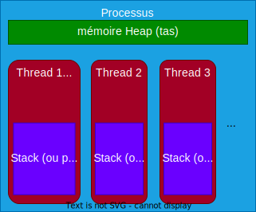

## Programmation asynchrone

Tout application démarre avec un seul processus et un seul thread d'exécution. Dans une application graphique, ce thread s'appelle le thread principal ou le thread UI et c'est lui qui gère l'affichage et les interactions avec l'utilisateur.


Si on effectue des traitements longs (calcul d'un Fibonacci ou des nombres premiers) ou bloquants (attente de la réponse d'un serveur HTTP) dans le thread principal, il sera bloqué dans la partie _"mise à jour de l'état de l'application"_, causant ainsi un blocage de l'affichage et des interaction (les fameux **freeze**).
C'est pour cela qu'on va effectuer ces traitements dans des threads.
Ces derniers permettent de lancer des traitements en même temps sans bloquer le thread UI.



La programmation avec les threads fait partie d'un concept plus général appelé **programmation asynchrone**.

- La programmation asynchrone consiste à exécuter plusieurs traitements en même temps (en d'autres termes, je peux lancer une fonction et passer à la suite avant qu'elle se termine).
- En programmation, on écrit du code asynchrone via différntes API selon le langage: async await, promesses, threads, Rx (observables et observers), coroutines etc.
- Beaucoup des ces API créent ce qu'on peut qualifier des Thread virtuels. Ce sont des threads gérées par le programme et non par l'OS. Ceci permet de lancer plusieurs threads virtuels au sein d'un seul thread OS (on parle aussi de thread porteur).
  - En Kotlin: les thread virtuel sont appelés **coroutines**.
  - En C#: **taches asynchrones**
  - En java: **Thread virtuels**
- Pourquoi faire des threads virtuels ? Car le coût d'un thread OS est élevé est on est limité par le nombre de thread OS qu'on peut créer à la fois.
- Cas particulier de JavaScript: un seul thread est utilisé pour faire de la programmation asynchrone (via un even Loop). On peut créer un équivalent de thread via les WebWorkers.

## Installeur

Une fois l'application développée, testée et prête à partir en production, il faudra la fournir aux utilisateurs. Plusieurs moyens s'offrent à nous:

- Fournir une archive compressée
- Fournir une application portable: comme un dmg sur mac ou une archive auto extractable sur windows.
- Fournir un installeur comme Wix pour windows
- Mettre à disposition sur un gestionnaire de paquêts
  - Windows: Scoop, Chocolatey ou winget
  - Ubuntu: apt
  - Javascript: npm
  - Python: PyPi (pour installation avec pip). [Voici un tuto](https://medium.com/@joel.barmettler/how-to-upload-your-python-package-to-pypi-65edc5fe9c56)
- Mettre à disposition sur un magasin d'applications (Windows store, App Store, etc.)

## Paradigmes de programmation

Voici exemple de programmation déclarative et impérative en TypeScript:

```ts
// typage implicite: la variable infère son type
let i = 10;
i = 20;
// typage statique, on ne peut pas changer le type d'une variable
//i = "Hello";

const items = [10, 34, -1, 44];
// const en TS empêche la réassignation (mais n'interdit pas la mutation)
// items = []

// Style de programmation impératif
const resultItems = [];
for (const item of items) {
  if (item > 0) {
    resultItems.push(item * 2);
  }
}
console.log(resultItems);

// Style déclaratif => sortie = f(entrée)
// Le code va refléter ou exprimer ce qu'on veut faire (et pas comment le faire)

const filterdItems = items.filter((item) => item > 0);
console.log(filterdItems);
const result2Items = filterdItems.map((item) => item * 2);
console.log(result2Items);

const result3Items = items.filter((item) => item > 0).map((item) => item * 2);
console.log(result3Items);
```

- La programmation déclarative a un style qui plus orienté vers la description de ce qu'on veut faire alors que la programmation impérative décrit comment le faire
- Actuellement, la programmation impérative est généralement plus optimale que la programmation déclarative, mais ça dépend des compilateurs, des langages et du type de programme qu'on écrit.
- La programmation déclarative permet de plus facilement rendre son traitement asynchrone par sa façon de coder (c'est plus facile de rendre asynchrone les fonctions qu'on veut plutôt qu'un ensemble de code impératif)

### Le style impératif pour coder l'UI

### Le style déclaratif pour coder l'UI

- En déclaratif, la mise à jour de l'UI se base généralement sur un **état** qui sera **lié** à un ou plusieurs composants graphiques. Dès que l'état change, le composant graphique met à jour son rendu. On parle alors de **binding** ou **liaison**.
-

```kotlin
@Composable
fun App() {
    val platformName = getPlatformName()
    Card {
        var expanded by remember { mutableStateOf(false) }
        Column(Modifier.clickable { expanded = !expanded }) {
            Text(
                text="Click me !",
                style = MaterialTheme.typography.h2
            )
            AnimatedVisibility(expanded){
                Text(
                    text = "Hello, ${platformName} 🎊",
                    style = MaterialTheme.typography.h1
                )
            }
        }
    }
}
```

## UX et accessibilité

> L'expérience utilisateur (en anglais, user experience ou UX en abrégé) est la qualité du vécu de l'utilisateur dans des environnements numériques ou physiques.

[source wikipedia](https://fr.wikipedia.org/wiki/Exp%C3%A9rience_utilisateur)

> L'accessibilité est la mise à disposition de vos sites web au plus grand nombre. On pense souvent que cela s'adresse aux personnes ayant un handicap, mais cela concerne également d'autres groupes comme ceux utilisant des appareils mobiles ou ceux qui ont des connexions internet de faible débit.

[source MDN](https://developer.mozilla.org/en-US/docs/Learn/Accessibility/What_is_accessibility)

### Types de handicap à envisager

- Troubles de la vue
- Troubles de l'audition
- Troubles au niveau de la mobilité
- Déficiences cognitives

Plus de détails dans [le site d'Apple](https://developer.apple.com/accessibility/) et [Mozilla](https://developer.mozilla.org/fr/docs/Learn/Accessibility/What_is_accessibility#quel_genre_de_handicap_devons_nous_envisager)

### Lignes directrices et législation

Pour le web, on a le [WGAC de la W3C](https://www.w3.org/WAI/standards-guidelines/wcag/fr).
Pour le mobile, on le [WAI de la W3C](https://www.w3.org/WAI/standards-guidelines/mobile/).
Pour le desktop c'est un peu compliqué.

[European Mobile Act](https://ec.europa.eu/social/main.jsp?catId=1202#navItem-1)

> From June 23, 2021, public sector bodies have the responsibility to make their mobile app content accessible to everyone.

[article de mobilea11y sur EAA](https://mobilea11y.com/blog/european-accessibility-act/)
